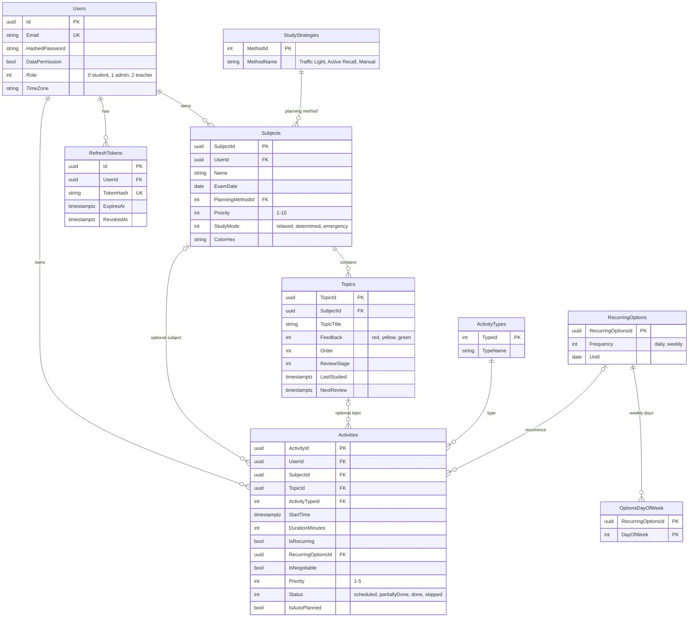

# MedApp — MedStudy Planner

A study planner for medical students. Students keep their subjects, topics and weekly timetable in one place;
the planner fills free time with study sessions based on exam dates, subject mode and how well each topic is
known (traffic-light and active-recall strategies), and warns about overloaded days. Teachers see anonymous,
aggregated analytics of students who agreed to share their data.

## Features

- Accounts with short-lived JWT access tokens and rotating refresh tokens (replay detection, rate-limited login).
- Subjects (exam date, mode, priority, strategy), topics with traffic-light feedback, activities with
  daily/weekly recurrence; every row belongs to one user and is invisible to others.
- Study planner: sessions in the student's time zone, spaced repetition for active recall, automatic
  re-planning, overload warnings. Rules: [`docs/PLANNING.md`](docs/PLANNING.md).
- Teacher dashboard: aggregates over consenting students only, nothing shown below 5 students.
- Admins grant the teacher and admin roles.

## Running with Docker

Requirements: Docker with Compose v2.24 or newer.

```bash
cp .env.example .env
# set POSTGRES_PASSWORD and JWT_KEY (at least 32 characters, e.g. `openssl rand -base64 48`)
docker compose up --build
```

Open http://localhost:3000 and create an account. On the first visit the app offers demo data, which is
generated in the browser and saved through the normal API.

Optional database seed with demo accounts (student, teacher, admin; password `Demo1234!`), after the API
has started once:

```bash
docker compose exec -T postgresql psql -U <POSTGRES_USER> -d <POSTGRES_DATABASE> < infra/scripts/Diploma_DB_seed.sql
```

The first admin of a real deployment is set in SQL: `UPDATE "Users" SET "Role" = 1 WHERE "Email" = '...';`.
After that, roles are managed in the app (Users view).

### Production profile

```bash
docker compose -f docker-compose.yml -f docker-compose.prod.yml up -d --build
```

Publishes only the web app (nginx, `FRONTEND_PORT`, default 80); the API and PostgreSQL stay inside the
compose network, and the API trusts forwarded client IPs from that network only. Put TLS in front of nginx.
Set `DB_MIGRATE_ON_STARTUP=true` only for a deploy that should migrate, after a `pg_dump`.

## Environment variables (`.env`)

| Variable | Purpose |
|---|---|
| `ASPNETCORE_ENVIRONMENT` | `Development` enables Swagger at `/swagger` on the API port |
| `API_HTTP_PORT` | Host port of the API (development only; not published in production) |
| `FRONTEND_PORT` | Host port of the web app (default 3000; 80 in the production profile) |
| `POSTGRES_DATABASE`, `POSTGRES_USER`, `POSTGRES_PASSWORD` | Database created by the `postgres` container |
| `POSTGRES_PORT` | Host port of PostgreSQL (development only); inside compose the API always uses 5432 |
| `DB_MIGRATE_ON_STARTUP` | Apply pending EF Core migrations when the API starts |
| `JWT_ISSUER`, `JWT_AUDIENCE`, `JWT_KEY` | Token signing; the API refuses to start without a key of 32+ characters |
| `JWT_ACCESS_TOKEN_MINUTES`, `JWT_REFRESH_TOKEN_DAYS`, `JWT_CLOCK_SKEW_SECONDS` | Token lifetimes |

`appsettings*.json` are committed without secrets; keep secrets in `.env`, user-secrets or environment variables.

## Local development without Docker for the apps

```bash
# database only
docker compose up -d postgresql

# API on http://localhost:8080 (launchSettings "http" profile)
cd backend/src/MedApp.API
dotnet user-secrets init
dotnet user-secrets set "ConnectionStrings:Postgres" "Host=localhost;Port=5432;Database=medapp;Username=medapp;Password=..."
dotnet user-secrets set "Jwt:Key" "<32+ characters>"
dotnet user-secrets set "Database:MigrateOnStartup" "true"
dotnet run

# frontend on http://localhost:3000 (Vite proxies /api to :8080)
cd frontend
npm ci
npm run dev
```

## Tests and checks

```bash
dotnet test MedApp.sln          # planner/analytics unit tests + API integration tests (needs Docker: Testcontainers Postgres)
dotnet format --verify-no-changes
cd frontend && npm run typecheck && npm run build
```

CI (`.github/workflows`) runs all of these on pull requests.

## Architecture

```
frontend/  React 18 + Vite + Zustand, served by nginx, which proxies /api to the API
backend/
  src/MedApp.Models     entities and enums
  src/MedApp.Services   DTOs, validators (FluentValidation), mapping (AutoMapper), services,
                        repository interfaces, Planning/ and Analytics/ (pure functions)
  src/MedApp.DAL        EF Core DbContext, entity configurations, migrations, repositories
  src/MedApp.API        controllers, DI, authentication, rate limiting
  tests/                MedApp.Services.Tests (unit), MedApp.API.Tests (integration)
docs/PLANNING.md        planning rules
infra/scripts/          optional demo seed SQL
```

Requests flow controller → service → repository → EF Core. Controllers take the caller's id from the access
token and pass it to every service call; repositories filter owned data by it, so another user's row behaves
as if it did not exist (404). Services accept and return DTOs only. Enums travel as camelCase strings.

### Data model



### API overview

| Endpoint | Notes |
|---|---|
| `POST /api/auth/register \| login \| refresh \| logout`, `GET /api/auth/me` | Register/login rate-limited per client IP |
| `GET/POST /api/subjects`, `GET/PUT/DELETE /api/subjects/{id}` | Delete removes the subject's topics and activities |
| `GET /api/topics`, `GET/POST /api/subjects/{id}/topics`, `GET/PUT/DELETE /api/topics/{id}` | A changed rating counts as a review |
| `GET/POST /api/activities`, `GET/PUT/DELETE /api/activities/{id}`, `PATCH /api/activities/{id}/status` | `?from=&to=` window includes recurring series |
| `GET /api/study-strategies`, `GET /api/activity-types` | Seeded lookups |
| `POST /api/planning/generate`, `GET /api/planning/warnings` | Study planner |
| `PUT /api/users/me` | Profile and data-sharing consent |
| `GET /api/users`, `PUT /api/users/{id}/role` | Admin only |
| `GET /api/teacher/analytics` | Teacher and admin |

Full schemas: Swagger UI at `http://localhost:<API_HTTP_PORT>/swagger` in the Development environment.
